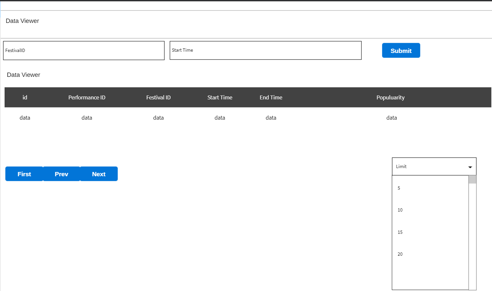

# Wireframe & Justification

This document should help you explain how your user interfaces are designed. You should have a wireframe to give a good overview and some screenshot with simple writeups to justify your designs.

## Wireframe

> This is just an example, please find your own wireframe.

## Justifications

### Justification 1

> This is just an example, please find your own justifications.

#### Good Points

- Has everything the user needs to key in
- Pagination for user to browse through the pages
- Search bar for retrieving data

#### Bad Points
- A bit too much more detail than the user needs

### Justification 2

#### Good Points

1. Attributes shown at top and bottom can be useful for big table.
2. Showing total number of entries can be useful for us.
3. Search bars for navigation
4. Has editing, upload and deletefeatures

#### Bad Points

1. Data boxes a bit too big and this may not be ideal as we do not need big data boxes for storing the data.
2. Data with many column may be bad. 
3. The translated search bar may not be needed as we are only searching by festivalId, startTime and endTime.

## Justification 3:

Link: (https://getbootstrap.com/docs/4.3/examples/carousel/)
### Good attributes:
- Looks sleek
- Has boxes to display the data
- Has a search bar to query for data
- Home and nav bars

### Bad attributes
- A bit difficult to implement
- Hard to put into the context of a music festival
- No pagination
