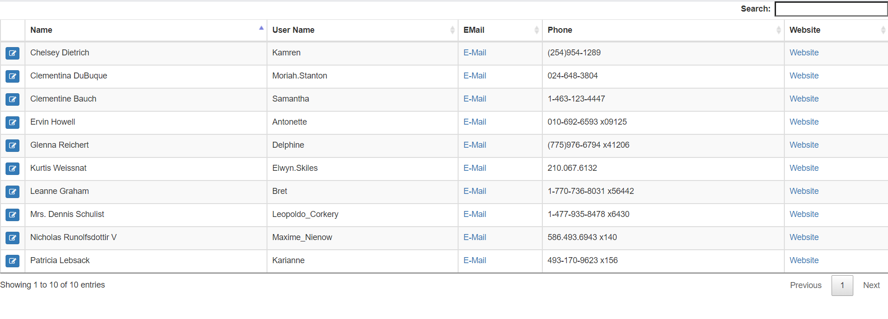
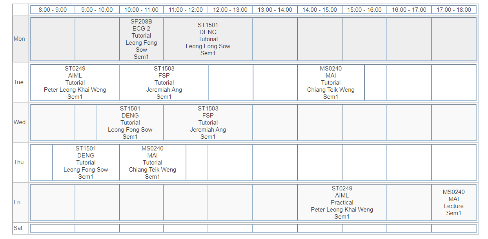

# Wireframe & Justification

This document should help you explain how your user interfaces are designed. You should have a wireframe to give a good overview and some screenshot with simple writeups to justify your designs.

<!-- ## Wireframe

> This is just an example, please find your own wireframe.

## Justifications -->

### Justification 1

https://datatables.net/
#### Good Points

1. User can comprute the result with the input of Festival ID and Start Time of performance.

#### Bad Points

1. User had to key in keywords for filteration (would be better if filter options are provided).

### Justification 2

#### Good Points

1. User can key in the key words in the input columns for filteration.
2. Results are arranged in rows, which allow users to compare the results easily.

#### Bad Points

1. Key words have to be key in in order to have results, it would be better if there are festival IDs and Start Times shown for user to choose from.
2. No button for adjusting page size.

### Justification 3

#### Good Points

1. Timing slots are shown.
2. Easy to view in one glance.

#### Bad Points

1. No buttons are provided for changing page and page size.
2. No input column for filteration.
