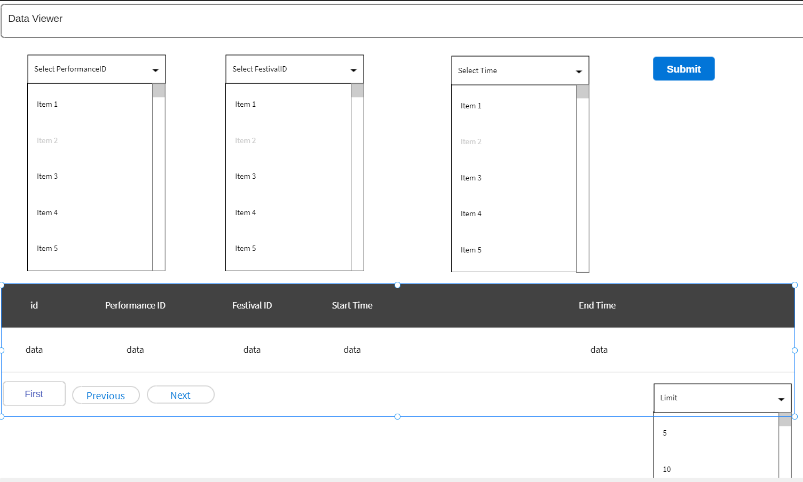
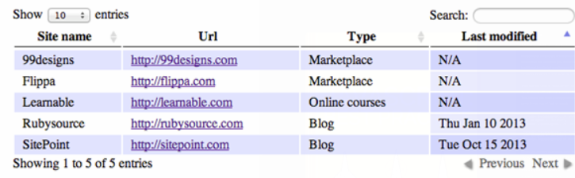
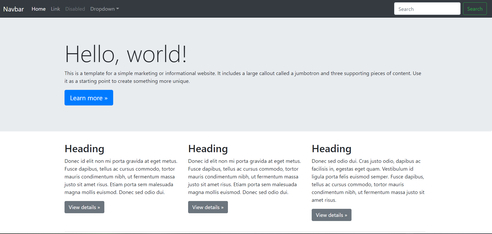
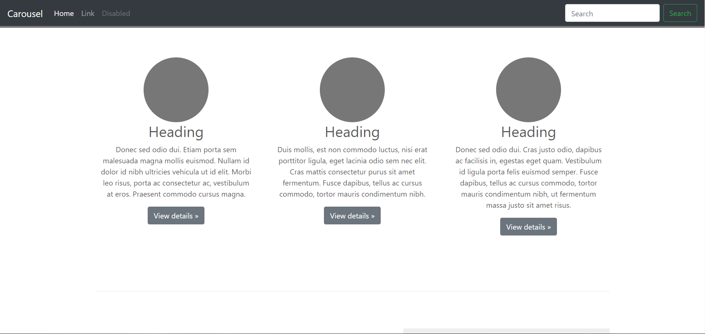

# Wireframe & Justification

This document should help you explain how your user interfaces are designed. You should have a wireframe to give a good overview and some screenshot with simple writeups to justify your designs.

## Wireframe

> This is just an example, please find your own wireframe.

## Justifications

### Justification 0

> This is just an example, please find your own justifications.

#### Good Points

1. Attributes shown at top and bottom can be useful for big table.
2. Showing total number of entries can be useful for some instance.
3. Pagination tool meets requirement

#### Bad Points

1. May need more than 1 search bar as we need to search by multiple attributes
2. Data with many column may be bad.

## Wireframe 1

## Justification 1
 
Link: (https://www.sitepoint.com/working-jquery-datatables/)
### Good attributes:
- Has everything the user needs to key in
- Pagination for user to browse through the pages
- Search bar for retrieving data

### Bad attributes:
- A bit too much more detail than the user needs

## Justification 2

Link: (https://getbootstrap.com/docs/4.3/examples/jumbotron/)
### Good attributes:
- Looks sleek
- Has a nice title screen

### Bad attributes
- A bit difficult to implement
- Hard to put into the context of a music festival
- No pagination

## Justification 3:

Link: (https://getbootstrap.com/docs/4.3/examples/carousel/)
### Good attributes:
- Looks sleek
- Has boxes to display the data
- Has a search bar to query for data
- Home and nav bars

### Bad attributes
- A bit difficult to implement
- Hard to put into the context of a music festival
- No pagination

